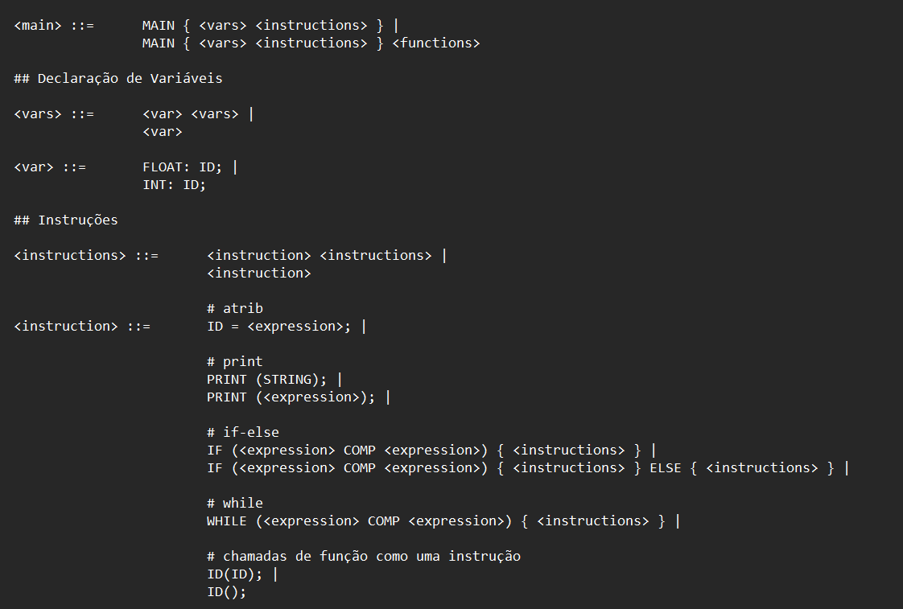
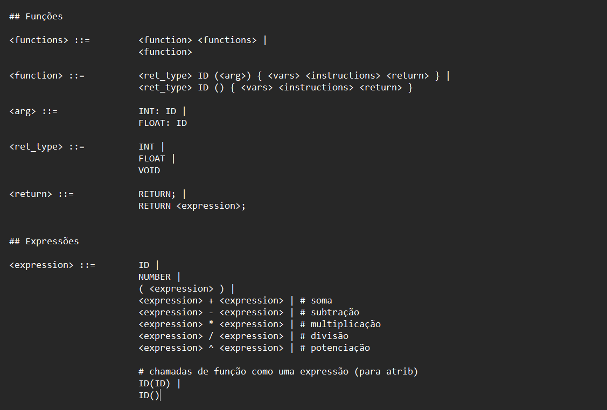
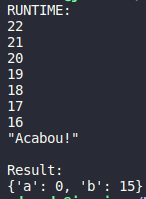

# Linguagem Kobra

## Desenvolvedores
- [João Lucas de Moraes Barros Cadorniga](https://github.com/JoaoLucasMBC)
- [Eduardo Mendes Vaz](https://github.com/EduardoMVAz)

## Descrição e Finalidade

A finalidade da linguagem Kobra é focada em operações matemáticas. Para isso, a linguagem possui suporte para operações matemáticas básicas, como soma, subtração, multiplicação e divisão, além de uma operação mais complexa, a potenciação. 

A linguagem também possui suporte para operações de comparação, como maior que, menor que, igual a, etc. Tais comparações são usadas para operações de controle de fluxo (if e else) e laços de repetição (while).

Kobra também possui suporte para a operação de saída `print`, que realiza a impressão de dados na tela. Dessa maneira, o desenvolvedor pode fazer checkpoints das suas calculações durante a execução do programa.

Por fim, a linguagem também possui suporte para **MODULARIZAÇÃO**, ao poder criar novos métodos que podem ser acessados na função *main*.

## **Principais funções:**

* 2 tipos: int e float  
* Operações matemáticas básicas: +, -, *, /, ^  
* Operações de comparação: >, <, >=, <=, ==, !=  
* Operações de controle de fluxo: if, else  
* Operações de repetição: while  

### Novidades criativas:

* Operação de saída: print  
* Modularização: funções definidas ao final do arquivo podem ser chamadas na função main

### Detalhes das funcionalidades:

* A execução da linguagem Kobra é usando python como linguagem intermediária  

* A linguagem utiliza chaves para delimitar blocos de código, evitando problemas como o *dangling else* e facilitando a visualização do código

* A linguagem possui suporte para comentários de linha, que são iniciados com `//`

* A tipagem da linguagem é estática, ou seja, o tipo de uma variável é definido no momento da sua criação e não pode ser alterado

* Todos os métodos devem ser definidos após a função main, e devem ser chamados dentro da função main

* Os métodos devem ter um tipo de retorno definido, e esse tipo deve ser o mesmo do tipo da variável que irá receber o retorno do método. Retorno não é obrigatório, para isso, o tipo de retorno deve ser `void` e o statement de retorno deve ser apenas `return;`

* Os métodos podem receber apenas UM parâmetro, com tipo definido.

* Todos os métodos, incluindo a main, devem ser compostos de, primeiramente, declarações de variáveis, e então statements. Declarações de variáveis devem ser feitas no início do método, e statements devem ser feitos após as declarações de variáveis.

* Mantendo sua característica estática, algumas observações são importantes:  
    * Não é possível realizar operações entre variáveis de tipos diferentes;  
    * Não é possível criar mais de uma variável com o mesmo nome, mesmo que esteja em outro escopo, isso causará que a variável seja sobrescrita;  
    * Pelo mesmo motivo descrito acima, ainda não é possível realizar recursão;

* Métodos podem apensar ser chamados individualmente ou para seu retorno ser atribuído para uma variável, mantendo o controle da linguagem.

## **[Gramática](./gramatica-kobra.txt)**




## Exemplos de código

```kobra
main {
    int: a;
    int: res;

    a = 7;
    res = 1;

    print("Calculating the factorial of:");
    print(a);

    while (a > 1) { // that is the factorial function!
        res = res * a;
        a = a - 1;
        print("Partial result:");
        print(res);
    }
}
```

## **Saídas e Execução:**

Ao executar um programa em `.kbr`, você perceberá que o programa irá imprimir no terminal o resultado da execução do código. Por exemplo, para o código `in02.kbr`:



Sendo que os prints em abaixo de "RUNTIME" representam as coisas impressas durante a execução do código Kobra (usando `print`), e o "Result" representa o **estado final de TODAS as variáveis criadas no código, inclusive as locais**.

</br>

# **COMO UTILIZAR A LINGUAGEM**

Para utilizar a linguagem, clone o repositório na sua máquina:
        
        git clone https://github.com/JoaoLucasMBC/paradigmas-kobra.git

Crie um ambiente virtual na pasta do projeto:

    windows:
        python -m venv env
    linux:
        python3 -m venv env

E instale todas as dependências do projeto, presentes em `requirements.txt`:

        pip install -r requirements.txt

No notebook `kobra.ipynb`, está a linguagem está dividida em paradigmas demonstrando o processo de desenvolvimento, com exemplos. Caso prefira, você pode executar o notebook para ver o funcionamento da linguagem.

## Criando um arquivo .kbr

Siga alguns passos importantes para seguir as regras da linguagem:

1. Crie um arquivo de texto na pasta do repositório, com a extensão `.kbr` (exemplo: `meu-arquivo.kbr`)  
2. Escreva seu código Kobra no arquivo criado, seguindo as regras da linguagem (consulte a gramática *no começo do arquivo* ou um dos exemplos `.kbr` presentes no repositório)  
3. Todo seu código deve estar dentro de um escopo de função `main`, que é o ponto de entrada do programa  
4. Primeiro, DEVEM haver declaração de variáveis  
5. Segundo, DEVEM haver instruções  
6. Opcionalmente, você pode criar funções, que devem ser definidas após a função `main` e chamadas dentro dela  
7. Todos os comandos de controle de fluxo e repetição devem estar dentro de chaves `{}`  
8. TODO final de instrução deve ser marcado com `;`

## **Compilando a linguagem de arquivos .kbr**

Já o arquivo `kobra.py` é como um "compilador" da linguagem. Você pode usar esse arquivo para rodar códigos escritos em Kobra. Para fazer isso, você deve criar um arquivo de texto na pasta do repositório, **que contenha um código Kobra válido** (para entender como usar a linguagem, consulte a explicação acima, a gramática *no começo do arquivo* ou um dos exemplos `.kbr` presentes no repositório) e então executar o seguinte comando:

    windows:
        python kobra.py caminho-do-arquivo-aqui.extensão-do-arquivo
    linux:
        python3 kobra.py caminho-do-arquivo-aqui.extensão-do-arquivo

O executor irá então imprimir no terminal o resultado da execução do arquivo. Como já demonstrado, para o exemplo `in02.kbr`, a saída no terminal seria:


## Dependências e Funcionalidades

A linguagem Kobra foi desenvolvida usando Python como base e usando a biblioteca rply.